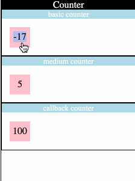
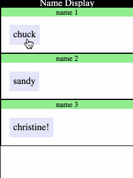
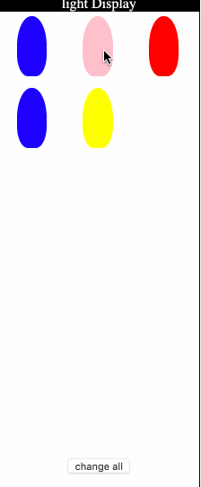

# JS OOP Prototype

### Featureset 1 - counter basic

 (please note that this shows all 3 counters running)

- This counter displays a number in an existing dom element, and can be clicked on to increment the value in the dom element

1. modify exercises/counterbasic.js
1. create the following methods
	1. constructor
		- arguments
			- number, the initial value of the counter
			- dom element, the dom element that the counter will use for displaying
		- return
			- nothing
		- purpose
			- set up initial object state
				- value
				- dom element
			- bind event handlers
			- add click handlers
			- update the dom element display
	1. addClickHandler
		- arguments
			- none
		- return
			- none
		- purpose
			- add the handleClick function as a click handler to the object's dom element
	1. update
		- arguments
			- none
		- return
			- none
		- purpose
			- update the dom element with the current counter value
	1. increment
		- arguments
			- none
		- return
			- none
		- purpose
			- increment the counter's value
			- update the display
	1. handleClick
		- arguments
			- none
		- return
			- none
		- purpose
			- increment the object's value

### Featureset 2 - counter medium

#### you should not copy the code from counter basic.  Make it new to get more practice!  The object has different requirements, as well!

- This object is much like the first one, except it makes its own dom element.  It can also be clicked on to increase the number

1. modify exercises/countermedium.js
1. create the following methods
	1. constructor
		- arguments
			- number, the initial value of the counter
		- return
			- nothing
		- purpose
			- set up initial object state
				- initial value
				- dom element
			- bind event handlers
	1. render
		- arguments
			- none
		- return
			- dom element
		- purpose
			- creates dom elements
				- a div with a class of 'counter'
			- stores them into the object's properties / state
			- updates the dom element from the object's value
			- return the container dom element
	1. addClickHandler
		- arguments
			- none
		- return
			- none
		- purpose
			- add the handleClick function as a click handler to the object's dom element
	1. update
		- arguments
			- none
		- return
			- none
		- purpose
			- update the dom element with the current counter value
	1. increment
		- arguments
			- none
		- return
			- none
		- purpose
			- increment the counter's value
			- update the display
	1. handleClick
		- arguments
			- none
		- return
			- none
		- purpose
			- increment the object's value

### Featureset 3 - counter callback

- This object, like the previous two, increases a dom element's value by 1 whenever the element is clicked on.  This one, however, includes a callback function to notify other code that the element has been clicked on

1. modify exercises/countercallback.js
1. create the following methods
	1. constructor
		- arguments
			- number, the initial value of the counter
		- return
			- nothing
		- purpose
			- set up initial object state
				- value
				- callback
				- dom element
			- bind event handlers
	1. getValue
		- arguments
			- none
		- return
			- number
		- purpose
			- gets the object's current value
	1. render
		- arguments
			- none
		- return
			- dom element
		- purpose
			- creates dom elements
				- a div with a class of 'counter'
			- stores them into the object's properties / state
			- updates the dom element from the object's value
			- return the container dom element
	1. addClickHandler
		- arguments
			- none
		- return
			- none
		- purpose
			- add the handleClick function as a click handler to the object's dom element
	1. update
		- arguments
			- none
		- return
			- none
		- purpose
			- update the dom element with the current counter value
	1. increment
		- arguments
			- none
		- return
			- none
		- purpose
			- increment the counter's value
			- update the display
	1. handleClick
		- arguments
			- none
		- return
			- none
		- purpose
			- call the stored callback function
				- pass in the current counter object as an argument for the callback
			- increment the object's value

### Featureset 4 - name capper

- this object displays a string and allows that text to be lowercased or uppercased as a toggle when the dom element is clicked

1. modify exercises/namecapper.js
1. create the following methods
	1. constructor
		- arguments
			- the initial string
		- return
			- nothing
		- purpose
			- store initial object state
				- the initial string
				- which mode the object is in (upper or lowercase)
				- the dom element
			- convert the initial string to lowercase
			- bind any event handlers
	1. render
		- arguments
			- none
		- return
			- dom element
		- purpose
			- make dom elements necessary for object
				- a div with a class of 'nameHolder'
			- add click handler to dom element
			- update the name into the dom element
			- return the dom element container
	1. update
		- arguments
			- none
		- return
			- none
		- purpose
			- puts the current string for this object into its dom element
	1. getName
		- arguments
			- none
		- return
			- string
		- purpose
			- returns the current string for this object
	1. upperCaseName
		- arguments
			- none
		- return
			- none
		- purpose
			- upper cases the string for this object
			- changes the mode so we know it is uppercase
	1. lowerCaseName
		- arguments
			- none
		- return
			- none
		- purpose
			- lower cases the string for this object
			- changes the mode so we know it is lowercase
	1. setName
		- arguments
			- string
		- return
			- true / false if it was able to store the string
		- purpose
			- saves the new string
			- lowercases the string
			- updates the display
			- returns true if it was able to store it, false if it wasn't
	1. handleClick
		- arguments
			- none
		- return
			- none
		- purpose
			- figured out which mode it currently is in
			- upper cases or lower cases depending on mdoe
			- updates the display

### Featureset 5 - christmas light

- this object takes in an array of colors, and cycles through those colors when you click on the elemnt

1. modify exercises/cnristmaslight.js
1. create the following methods
	1. constructor
		- arguments
			- array of color strings
		- return
			- nothing
		- purpose
			- store initial object state
				- the array of colors
				- the dom element
				- the current color
			- bind any event handlers
	1. render
		- arguments
			- none
		- return
			- dom element
		- purpose
			- make dom elements necessary for object
				- a div with a class of 'christmasLight'
			- add click handler to dom element
			- update the color into the dom element
			- return the dom element container
	1. displayColor
		- arguments
			- none
		- return
			- none
		- purpose
			- changes the background color of the element to the current color
	1. cycleColor
		- arguments
			- none
		- return
			- none
		- purpose
			- changes the current color to the next color, or back to the beginning color if we have run out of colors
			- displays the current color
	